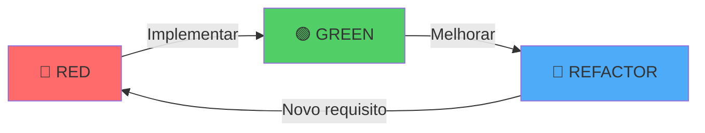
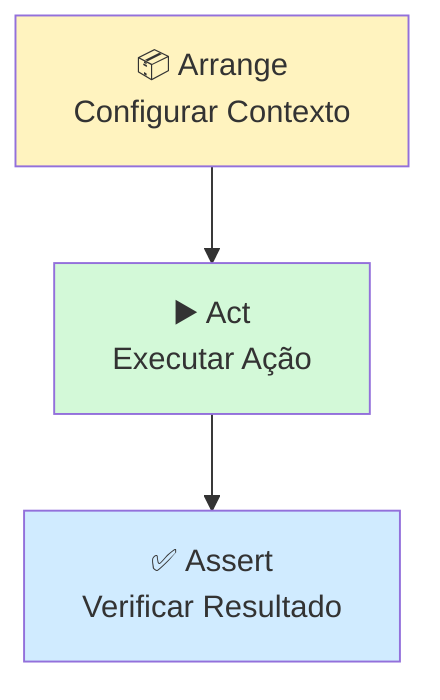
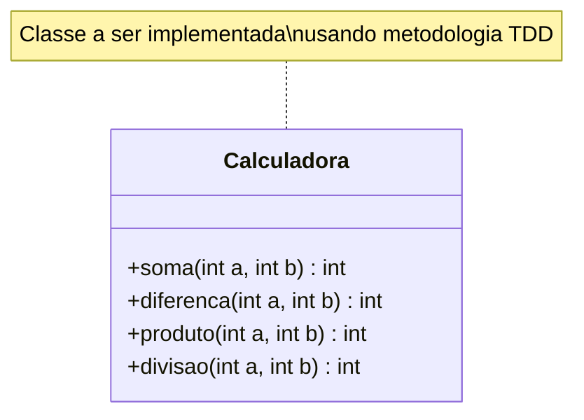
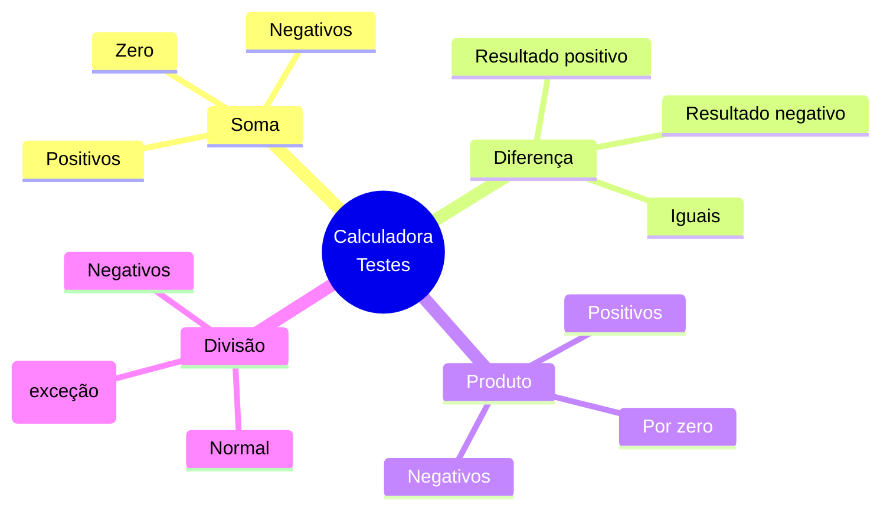
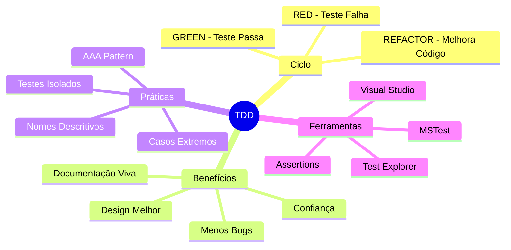

# Laboratório Prático: Test-Driven Development (TDD) com C# e MSTest

## 📋 Informações da Disciplina
- **Disciplina:** Engenharia de Software
- **Curso:** Graduação em Computação
- **Tema:** Test-Driven Development (TDD) e Testes Unitários

---

## 🎯 Objetivos de Aprendizagem

Ao completar este laboratório, você será capaz de:

1. Compreender os fundamentos da metodologia TDD
2. Aplicar o ciclo Red-Green-Refactor no desenvolvimento
3. Configurar e utilizar MSTest no Visual Studio
4. Escrever testes unitários seguindo o padrão AAA (Arrange-Act-Assert)
5. Implementar código guiado por testes
6. Aplicar boas práticas de testes unitários

---

## 📚 Revisão de Conceitos

### O que é Test-Driven Development (TDD)?

**TDD (Test-Driven Development)** é uma metodologia de desenvolvimento de software onde os testes são escritos **antes** da implementação do código de produção. Esta abordagem inverte o fluxo tradicional de desenvolvimento, transformando os testes em especificações executáveis do comportamento esperado do sistema.

#### Princípios Fundamentais do TDD

1. **Especificação Executável:** Cada teste documenta e valida um requisito específico
2. **Feedback Rápido:** Ciclos curtos de desenvolvimento com validação constante
3. **Design Emergente:** A arquitetura evolui naturalmente guiada pelos testes
4. **Refatoração Segura:** Testes garantem que melhorias não quebrem funcionalidades

### O Ciclo Red-Green-Refactor

O TDD segue um ciclo iterativo de três fases:



#### 🔴 RED - Escrever um Teste que Falha
- Defina o comportamento esperado através de um teste
- Execute o teste e observe a falha (comportamento esperado)
- A falha confirma que o teste é válido e está detectando a ausência de implementação

#### 🟢 GREEN - Fazer o Teste Passar
- Implemente a solução mais simples que faça o teste passar
- Foco em fazer funcionar, não em perfeição
- Execute os testes e verifique o sucesso

#### 🔵 REFACTOR - Melhorar o Código
- Melhore a qualidade do código mantendo os testes passando
- Elimine duplicação, melhore legibilidade
- Execute os testes para garantir que nada quebrou

### Testes Unitários

**Testes Unitários** são testes automatizados que verificam o comportamento de unidades individuais de código (geralmente métodos ou funções) de forma isolada.

#### Características de Bons Testes Unitários (F.I.R.S.T.)

- **Fast (Rápido):** Executam rapidamente
- **Independent (Independente):** Não dependem de outros testes
- **Repeatable (Repetível):** Produzem os mesmos resultados sempre
- **Self-Validating (Auto-validável):** Passam ou falham claramente
- **Timely (Oportuno):** Escritos no momento certo (antes do código)

#### Padrão AAA (Arrange-Act-Assert)



---

## 🏗️ Estrutura da Atividade

### Diagrama UML da Classe Calculadora



### Casos de Teste a Implementar



---

## 🛠️ Roteiro de Implementação

### Pré-requisitos

- Visual Studio 2019 ou superior
- .NET 6.0 ou superior
- Conhecimentos básicos de C#

### Passo 1: Criar o Projeto Console Application

1. Abra o Visual Studio
2. Clique em **Create a new project**
3. Selecione **Console App (.NET)** com C#
4. Configure o projeto:
   - **Project name:** CalculadoraTDD
   - **Solution name:** CalculadoraTDD
   - **Location:** Escolha um diretório apropriado
5. Clique em **Create**

### Passo 2: Adicionar a Classe Calculadora (Fase RED)

1. No **Solution Explorer**, clique com botão direito no projeto **CalculadoraTDD**
2. Selecione **Add → Class**
3. Nomeie como `Calculadora.cs`
4. Implemente a estrutura básica com métodos que lançam exceção:

```csharp
namespace CalculadoraTDD
{
    public class Calculadora
    {
        public int Soma(int a, int b)
        {
            throw new NotImplementedException();
        }

        public int Diferenca(int a, int b)
        {
            throw new NotImplementedException();
        }

        public int Produto(int a, int b)
        {
            throw new NotImplementedException();
        }

        public int Divisao(int a, int b)
        {
            throw new NotImplementedException();
        }
    }
}
```

### Passo 3: Adicionar Projeto de Testes

1. Clique com botão direito na **Solution** (não no projeto)
2. Selecione **Add → New Project**
3. Busque por **MSTest Test Project** (C#)
4. Configure o projeto de teste:
   - **Project name:** CalculadoraTDD.Tests
   - Certifique-se de que está na mesma solução
5. Clique em **Create**

### Passo 4: Adicionar Referência ao Projeto Principal

1. No **Solution Explorer**, expanda o projeto **CalculadoraTDD.Tests**
2. Clique com botão direito em **Dependencies**
3. Selecione **Add Project Reference**
4. Marque o projeto **CalculadoraTDD**
5. Clique em **OK**

### Passo 5: Implementar Testes Unitários (Fase RED)

Renomeie o arquivo `UnitTest1.cs` para `CalculadoraTests.cs` e implemente os testes seguindo as orientações abaixo.

#### 📋 Estrutura Geral da Classe de Testes

Sua classe de testes deve:

1. **Ter a anotação `[TestClass]`** no topo da classe
2. **Importar os namespaces necessários:**
   - `Microsoft.VisualStudio.TestTools.UnitTesting`
   - `CalculadoraTDD` (projeto principal)

3. **Declarar uma variável privada** do tipo `Calculadora`

4. **Implementar um método de Setup:**
   - Anotado com `[TestInitialize]`
   - Instancia o objeto `Calculadora` antes de cada teste
   - Garante que cada teste tenha uma nova instância (isolamento)

#### 🧪 Estrutura de Cada Método de Teste

Cada teste deve:

1. **Ter a anotação `[TestMethod]`**
2. **Seguir a convenção de nomenclatura:** `Metodo_Cenario_ResultadoEsperado`
3. **Implementar o padrão AAA:**

```csharp
[TestMethod]
public void NomeDoTeste()
{
    // Arrange: Preparar os dados de entrada
    // - Declare as variáveis necessárias
    // - Defina o resultado esperado
    
    // Act: Executar o método sendo testado
    // - Chame o método da calculadora
    // - Armazene o resultado em uma variável
    
    // Assert: Verificar o resultado
    // - Use Assert.AreEqual(esperado, obtido)
    // - Ou Assert.ThrowsException para exceções
}
```

#### 📝 Testes Obrigatórios por Método

##### **Método Soma**
Implemente pelo menos 3 testes:

1. **Soma de dois números positivos**
   - Exemplo: 5 + 3 = 8
   
2. **Soma com números negativos**
   - Exemplo: -5 + (-3) = -8
   
3. **Soma com zero**
   - Exemplo: 10 + 0 = 10

##### **Método Diferenca**
Implemente pelo menos 3 testes:

1. **Primeiro número maior que o segundo (resultado positivo)**
   - Exemplo: 10 - 3 = 7
   
2. **Primeiro número menor que o segundo (resultado negativo)**
   - Exemplo: 3 - 10 = -7
   
3. **Números iguais (resultado zero)**
   - Exemplo: 5 - 5 = 0

##### **Método Produto**
Implemente pelo menos 4 testes:

1. **Multiplicação de dois números positivos**
   - Exemplo: 4 × 5 = 20
   
2. **Multiplicação por zero**
   - Exemplo: 10 × 0 = 0
   
3. **Multiplicação de dois números negativos**
   - Exemplo: (-4) × (-3) = 12
   
4. **Multiplicação de positivo com negativo**
   - Exemplo: 5 × (-3) = -15

##### **Método Divisao**
Implemente pelo menos 4 testes:

1. **Divisão normal**
   - Exemplo: 20 ÷ 4 = 5
   
2. **Divisão com resto (deve retornar apenas o quociente inteiro)**
   - Exemplo: 10 ÷ 3 = 3
   
3. **Divisão por zero (deve lançar DivideByZeroException)**
   - Use: `[ExpectedException(typeof(DivideByZeroException))]`
   - Ou: `Assert.ThrowsException<DivideByZeroException>(() => ...)`
   
4. **Divisão de números negativos**
   - Exemplo: (-20) ÷ (-4) = 5

#### 🎨 Dicas de Organização

1. **Use `#region` para agrupar testes:**
   ```csharp
   #region Testes do Método Soma
   // Todos os testes de soma aqui
   #endregion
   ```

2. **Adicione comentários explicativos** em cada seção do AAA

3. **Nomes de variáveis claros:**
   - `a` e `b` para operandos
   - `resultadoEsperado` para o valor esperado
   - `resultado` para o valor obtido

#### ⚠️ Assertions Importantes

- **Para comparação de valores:**
  ```csharp
  Assert.AreEqual(valorEsperado, valorObtido);
  ```

- **Para verificar exceções (Opção 1 - Atributo):**
  ```csharp
  [TestMethod]
  [ExpectedException(typeof(DivideByZeroException))]
  public void Divisao_PorZero_LancaExcecao()
  {
      // Código que deve lançar a exceção
  }
  ```

- **Para verificar exceções (Opção 2 - Assert):**
  ```csharp
  Assert.ThrowsException<DivideByZeroException>(() => 
  {
      _calculadora.Divisao(10, 0);
  });
  ```

#### 💡 Exemplo de Estrutura Completa

```csharp
using Microsoft.VisualStudio.TestTools.UnitTesting;
using CalculadoraTDD;

namespace CalculadoraTDD.Tests
{
    [TestClass]
    public class CalculadoraTests
    {
        private Calculadora _calculadora;

        [TestInitialize]
        public void Setup()
        {
            // TODO: Instanciar a calculadora
        }

        #region Testes do Método Soma
        
        [TestMethod]
        public void Soma_DoisNumerosPositivos_RetornaSomaCorreta()
        {
            // TODO: Implementar teste
        }
        
        // TODO: Adicionar mais 2 testes de soma
        
        #endregion

        #region Testes do Método Diferenca
        
        // TODO: Implementar 3 testes de diferença
        
        #endregion

        #region Testes do Método Produto
        
        // TODO: Implementar 4 testes de produto
        
        #endregion

        #region Testes do Método Divisao
        
        // TODO: Implementar 4 testes de divisão
        
        #endregion
    }
}
```

#### 📊 Checklist de Implementação

Antes de prosseguir para o Passo 6, certifique-se de que:

- [ ] A classe tem a anotação `[TestClass]`
- [ ] O método Setup está implementado com `[TestInitialize]`
- [ ] Todos os **14** testes mínimos estão implementados
- [ ] Cada teste segue o padrão AAA com comentários
- [ ] Cada teste tem um nome descritivo seguindo a convenção
- [ ] Os testes estão organizados em regions por método
- [ ] O código compila sem erros

### Passo 6: Executar Testes - Fase RED (Todos Devem Falhar)

1. Abra o **Test Explorer**:
   - Menu: **Test → Test Explorer**
   - Ou use o atalho: `Ctrl + E, T`
2. Clique em **Run All Tests** (ícone de play verde duplo)
3. **OBSERVAÇÃO IMPORTANTE:** Todos os testes devem **FALHAR** (ícone vermelho ❌)
4. Isso confirma que:
   - Os testes estão configurados corretamente
   - Estamos seguindo a metodologia TDD (RED → GREEN → REFACTOR)

**📸 CAPTURA DE TELA OBRIGATÓRIA #1:** Capture a janela do Test Explorer mostrando todos os testes com falha (ícones vermelhos).

### Passo 7: Implementar Código da Calculadora - Fase GREEN

Agora implemente as versões corretas dos métodos na classe `Calculadora.cs`:

#### 💡 Dicas de Implementação

1. **Método Soma:**
   - Operação matemática básica
   - Retorne a soma dos dois parâmetros

2. **Método Diferenca:**
   - Operação de subtração
   - Retorne o primeiro parâmetro menos o segundo

3. **Método Produto:**
   - Operação de multiplicação
   - Retorne o produto dos dois parâmetros

4. **Método Divisao:**
   - **IMPORTANTE:** Verifique se o divisor é zero ANTES de dividir
   - Se o divisor for zero, lance uma `DivideByZeroException` com mensagem apropriada
   - Use: `throw new DivideByZeroException("mensagem");`
   - Caso contrário, retorne a divisão inteira

#### ⚠️ Pontos de Atenção

- Todos os métodos devem retornar `int`
- A divisão deve retornar apenas a parte inteira (comportamento padrão do operador `/` com inteiros)
- A exceção `DivideByZeroException` já existe no C#, não precisa criar
- Remova o `throw new NotImplementedException();` ao implementar cada método

### Passo 8: Executar Testes Novamente - Fase GREEN (Todos Devem Passar)

1. No **Test Explorer**, clique novamente em **Run All Tests**
2. **RESULTADO ESPERADO:** Todos os testes devem **PASSAR** (ícone verde ✅)
3. Isso confirma que:
   - A implementação está correta
   - Completamos o ciclo RED → GREEN
   - O código atende aos requisitos especificados pelos testes

**📸 CAPTURA DE TELA OBRIGATÓRIA #2:** Capture a janela do Test Explorer mostrando todos os testes com sucesso (ícones verdes).

### Passo 9: Refatoração (Opcional - Fase REFACTOR)

Neste caso, o código já está bastante simples. Exemplos de refatoração que poderiam ser aplicados:

- Adicionar validações adicionais
- Criar constantes para mensagens de erro
- Adicionar documentação XML
- Implementar tratamento de overflow

**Importante:** Após qualquer refatoração, execute os testes novamente para garantir que nada quebrou!

---

## 📊 Boas Práticas Aplicadas Neste Laboratório

### ✅ Nomeação de Testes

Os testes seguem o padrão: `Método_Cenário_ResultadoEsperado`

**Exemplos:**
- `Soma_DoisNumerosPositivos_RetornaSomaCorreta`
- `Divisao_PorZero_LancaExcecao`

### ✅ Padrão AAA (Arrange-Act-Assert)

Cada teste está claramente dividido em três seções:

```csharp
// Arrange: Preparação dos dados
int a = 5;
int b = 3;

// Act: Execução da operação
int resultado = _calculadora.Soma(a, b);

// Assert: Verificação do resultado
Assert.AreEqual(8, resultado);
```

### ✅ Organização com Regions

Testes agrupados logicamente por método testado usando `#region`.

### ✅ Setup com [TestInitialize]

Objeto `Calculadora` criado uma vez antes de cada teste, garantindo isolamento.

### ✅ Testes de Casos Extremos

- Valores positivos e negativos
- Operações com zero
- Exceções (divisão por zero)

---

## 📤 Entrega da Atividade

### Artefatos Necessários

Você deve submeter via **Microsoft Teams** um documento em formato **PDF ou Word** contendo:

#### 1. Captura de Tela #1 - Testes Falhando (RED)
- Screenshot do **Test Explorer** mostrando **todos os testes com falha**
- Deve ser visível:
  - Lista completa de testes
  - Ícones vermelhos (❌) indicando falha
  - Timestamp da execução

#### 2. Captura de Tela #2 - Testes Passando (GREEN)
- Screenshot do **Test Explorer** mostrando **todos os testes com sucesso**
- Deve ser visível:
  - Lista completa de testes
  - Ícones verdes (✅) indicando sucesso
  - Timestamp da execução
  - Tempo total de execução

#### 3. Código-Fonte Completo

**a) Classe de Teste Completa (`CalculadoraTests.cs`)**
```
- Incluir todo o código com comentários
- Formatação preservada
- Sintaxe destacada (se possível)
```

**b) Classe Calculadora Implementada (`Calculadora.cs`)**
```
- Versão final com todos os métodos implementados
```


### Instruções de Entrega

1.  ***A entrega é individual na atividade do TEAMS***

---

## 🎓 Conceitos-Chave para Fixação



---

## 📚 Referências e Material Complementar

### Livros Recomendados

1. **Beck, Kent.** *Test-Driven Development: By Example.* Addison-Wesley, 2003.
   - O livro clássico que popularizou TDD
   
2. **Martin, Robert C.** *Clean Code: A Handbook of Agile Software Craftsmanship.* Prentice Hall, 2008.
   - Capítulos 9: Unit Tests

3. **Osherove, Roy.** *The Art of Unit Testing: with Examples in C#.* Manning, 2013.
   - Guia completo sobre testes unitários em C#

### Documentação Oficial

- [Microsoft Docs - Unit Testing in .NET](https://docs.microsoft.com/en-us/dotnet/core/testing/)
- [MSTest V2 Framework](https://github.com/microsoft/testfx)
- [Visual Studio Test Explorer](https://docs.microsoft.com/en-us/visualstudio/test/run-unit-tests-with-test-explorer)

### Artigos e Tutoriais Online

- [Martin Fowler - Test-Driven Development](https://martinfowler.com/bliki/TestDrivenDevelopment.html)
- [Uncle Bob - The Three Rules of TDD](http://butunclebob.com/ArticleS.UncleBob.TheThreeRulesOfTdd)
- [Microsoft Learn - Testing Best Practices](https://docs.microsoft.com/en-us/dotnet/core/testing/unit-testing-best-practices)

### Vídeos Recomendados

- [Test-Driven Development Tutorial - FreeCodeCamp](https://www.youtube.com/watch?v=Jv2uxzhPFl4)
- [Uncle Bob - The Three Laws of TDD](https://www.youtube.com/watch?v=AoIfc5NwRks)

### Ferramentas Adicionais

- **NUnit:** Framework alternativo ao MSTest
- **xUnit:** Framework moderno e extensível
- **Moq:** Library para criação de mocks
- **FluentAssertions:** Assertions mais legíveis

---

## ❓ Perguntas Frequentes (FAQ)

### P: Por que todos os testes devem falhar primeiro?
**R:** Isso garante que o teste está realmente validando o código. Se um teste passa sem implementação, pode estar com erro ou ser inútil.

### P: Posso implementar mais de um método por vez?
**R:** No TDD puro, não. A ideia é fazer pequenos incrementos. Porém, para fins didáticos neste lab, você pode implementar todos após os testes.

### P: E se um teste falhar na fase GREEN?
**R:** Revise sua implementação. O objetivo é fazer o código mais simples que faça o teste passar.

### P: Preciso testar operações matemáticas simples?
**R:** Para fins de aprendizado, sim! Em projetos reais, focaríamos em lógica de negócio complexa.

### P: Quantos asserts por teste?
**R:** Idealmente um, focando em um único comportamento. Porém, múltiplos asserts relacionados ao mesmo comportamento são aceitáveis.

---

## 🏆 Desafio Extra (Opcional)

Para aprofundar seus conhecimentos, implemente:

1. **Novos Métodos:**
   - `Potencia(int base, int expoente)`
   - `RaizQuadrada(int numero)`
   - `Fatorial(int numero)`

2. **Testes Parametrizados:**
   - Use `[DataTestMethod]` e `[DataRow]` para testar múltiplos valores

3. **Tratamento de Exceções:**
   - Adicione validações para valores inválidos
   - Crie exceções customizadas

4. **Cobertura de Código:**
   - Instale extensão de Code Coverage
   - Alcance 100% de cobertura

---

## 📝 Checklist de Entrega

Antes de submeter, verifique:

- [ ] Documento está em formato PDF ou Word
- [ ] Capa com identificação completa
- [ ] Screenshot #1 (testes falhando) está presente e legível
- [ ] Screenshot #2 (testes passando) está presente e legível
- [ ] Código da classe de teste está completo e formatado
- [ ] Código da classe Calculadora está presente


